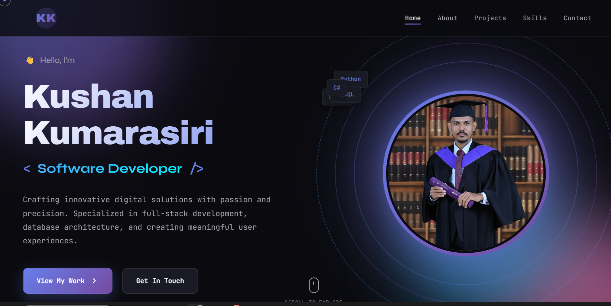
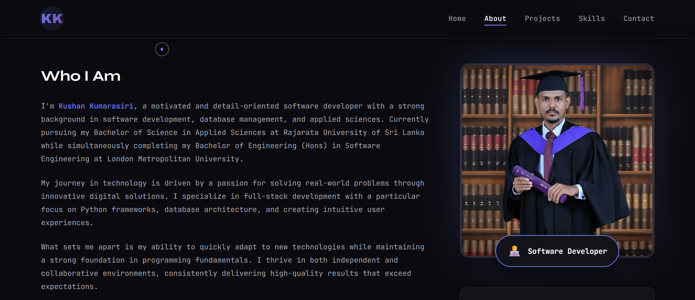
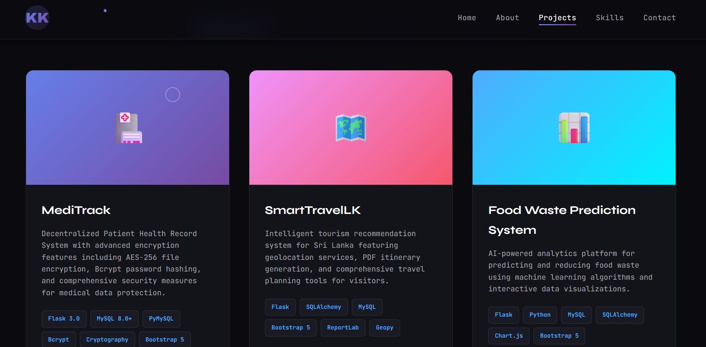
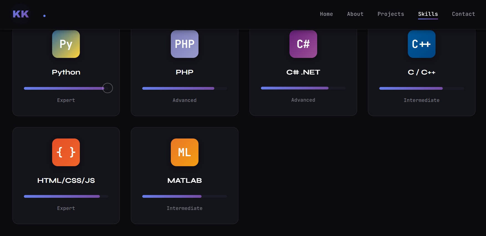
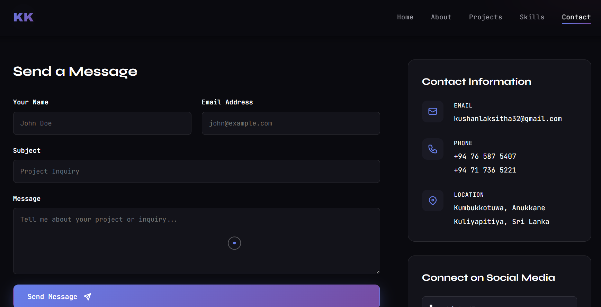

# 🚀 Kushan Kumarasiri - Personal Portfolio Website

A modern, fully-responsive personal portfolio website featuring creative CSS animations, interactive JavaScript elements, and professional design.



---

## 📋 Table of Contents

- [Overview](#overview)
- [Features](#features)
- [Pages](#pages)
- [Installation](#installation)
- [Adding Your Profile Image](#adding-your-profile-image)
- [Customization](#customization)
- [File Structure](#file-structure)
- [Browser Support](#browser-support)
- [Deployment](#deployment)
- [Contact](#contact)

---

## 🎯 Overview

This portfolio website showcases your professional experience, projects, skills, and provides an easy way for potential employers or clients to get in touch. Built with pure HTML, CSS, and JavaScript - no frameworks required!

**Key Highlights:**
- ✨ Creative gradient animations
- 🎨 Modern dark theme with purple-blue gradient accents
- 📱 Fully responsive design
- 🖼️ Animated profile image integration
- ⚡ Fast loading with optimized performance
- 🎭 Smooth page transitions and hover effects

---

## ✨ Features

### Design Features
- 🎨 Modern Dark Theme with vibrant gradient accents
- 🌈 Gradient Animations - Floating orbs and rotating borders
- 💫 Smooth Transitions - All interactions have polished animations
- 🎯 Interactive Elements - Hover effects, 3D tilts, and parallax scrolling
- 🎪 Custom Typography - Syne, Archivo Black, and JetBrains Mono fonts

### Functional Features
- 📊 Stats Counter - Animated number counters for achievements
- 🖼️ Profile Image Display - Creative circular and rounded designs
- 🔍 Project Filtering - Filter projects by category
- 📈 Skill Progress Bars - Animated skill level indicators
- 📝 Contact Form - Functional contact form with validation
- 🎨 Custom Cursor - Enhanced cursor on desktop

---

## 📄 Pages

### 🏠 Home Page


**Features:**
- Dynamic hero section with animated background
- Profile image with rotating gradient border
- Typing animation for role/title
- Animated statistics counters
- Featured projects preview

**Sections:**
1. Hero Section - Greeting, name, role, CTA buttons, profile image
2. Statistics - 3 academic programs, 6 projects, 8 technologies, 9 certifications
3. Featured Projects - Top 3 projects showcase

---

### 👤 About Page



**Features:**
- Professional profile image with badge
- Personal information cards
- Education timeline with animations
- Club memberships showcase

**Sections:**
1. Profile - Large image with "Software Developer" badge
2. About Content - Who I Am, My Approach (4 principles)
3. Personal Info - Full name, DOB, nationality, contact
4. Education Timeline:
   - Bachelor of Science - Rajarata University (2023 - Present)
   - BEng Software Engineering - London Metropolitan University (2024-2025)
   - BTEC HND Computing - Pearson College London (2022-2024)
   - G.C.E A/L - Physical Sciences (2021/2022)
   - G.C.E O/L (2017)
5. Memberships - IEEE, RUSL Hiking Club, Zero Plastic

---

### 💼 Projects Page



**Projects Showcased:**

1. **MediTrack** 🏥 - Decentralized Patient Health Record System
   - Flask 3.0, MySQL 8.0+, Bcrypt, Cryptography, AES-256 encryption

2. **SmartTravelLK** 🗺️ - Smart Sri Lanka Tourism Recommender
   - Flask, SQLAlchemy, Bootstrap 5, Geopy, PDF generation

3. **Food Waste Prediction** 📊 - AI-powered reduction system
   - Python, Flask, MySQL, Chart.js, ML analytics

4. **Expense Galaxy** 💰 - Visual Finance Tracker (Desktop)
   - Python 3.8+, Kivy 2.3, KivyMD 1.2, MySQL 8.0+

5. **LankaCraft** 🛍️ - Local Handicraft E-Commerce
   - Flask, Python 3.8+, MySQL, SQLAlchemy, Bootstrap 5

6. **Digital Recipe App** 🍳 - Web-based recipe management
   - HTML5, CSS3, JavaScript, PHP, MySQL

**Filter Categories:** All Projects, Web Apps, Desktop Apps, Security

---

### 🛠️ Skills Page



**Skill Categories:**

1. **Programming Languages**
   - Python (95% - Expert)
   - PHP (85% - Advanced)
   - C# .NET (80% - Advanced)
   - C / C++ (75% - Intermediate)
   - HTML/CSS/JavaScript (90% - Expert)
   - MATLAB (70% - Intermediate)

2. **Frameworks & Libraries**
   - Flask, SQLAlchemy, Bootstrap 5, Chart.js, Flask-Login
   - Kivy, KivyMD, ReportLab, Geopy, Bcrypt, Cryptography

3. **Database Technologies**
   - MySQL 8.0+ (Primary), SQLAlchemy ORM
   - Database design, query optimization, data migration

4. **Development Tools**
   - Git & GitHub, VS Code, XAMPP, PyCharm, Postman, Figma

5. **Certifications**
   - IEEE Student Membership
   - IEEEXtreme 18.0 & 19.0
   - BITCODE V5.0, RUSLXtreme 1.0 & 2.0
   - Postman API 101, ZeroPlastic Volunteer

---

### 📧 Contact Page



**Contact Information:**
- **Email:** kushanlaksitha32@gmail.com
- **Phone:** +94 76 587 5407 / +94 71 736 5221
- **Location:** Kuliyapitiya, Sri Lanka
- **LinkedIn:** linkedin.com/in/kushan-kumarasiri-542780258
- **GitHub:** github.com/KushanLaksitha

**Features:** Interactive contact form, social links, availability badge

---

## 🚀 Installation

### Quick Start (3 Steps)

1. **Download Files**
   - Extract all files to a folder

2. **Add Your Profile Image** (Optional)
   - Add `profile.jpg` (800x800px recommended)

3. **Open in Browser**
   - Double-click `index.html`

### File Structure Verification
```
my-portfolio/
├── index.html
├── about.html
├── projects.html
├── skills.html
├── contact.html
├── styles.css
├── pages.css
├── script.js
├── profile.jpg (your image)
└── README.md
```

---

## 🖼️ Adding Your Profile Image

### Method 1: Simple Replacement (Recommended)

1. **Prepare Your Image**
   - Format: JPG, PNG, or WebP
   - Size: 800x800px or larger (square)
   - Quality: High resolution, good lighting

2. **Rename and Place**
   - Rename to `profile.jpg`
   - Place in same folder as `index.html`

3. **Refresh Browser**
   - Press Ctrl+F5 (hard refresh)

### Image Specifications

**Recommended:**
- ✅ Square aspect ratio (1:1)
- ✅ Minimum 800x800 pixels
- ✅ Professional headshot
- ✅ Good lighting, simple background
- ✅ JPG or PNG format
- ✅ Under 500KB file size

**The img tags are located:**

**index.html (Line ~65):**
```html

```

**about.html (Lines ~40 and ~80):**
```html

```

### CSS Applied

**Home Page (styles.css):**
- Circular design (450px)
- Rotating gradient border (20s animation)
- Pulsing glow effect (3s breathing)
- 3 decorative rings rotating
- Hover scale effect (1.05x)

**About Page (pages.css):**
- Rounded square (20px radius)
- Glowing background blur
- Professional badge overlay
- Responsive sizing
- Hover border color change

---

## 🎨 Customization

### Changing Colors

Edit `styles.css` (lines 1-20):

```css
:root {
    --primary-gradient: linear-gradient(135deg, #667eea 0%, #764ba2 100%);
    --primary: #667eea;
    --accent: #4facfe;
    --bg-primary: #0a0a0f;
}
```

### Changing Fonts

Update Google Fonts link in all HTML files:

```html
<link href="https://fonts.googleapis.com/css2?family=Your+Font&display=swap" rel="stylesheet">
```

### Modifying Content

1. **Personal Information** - Edit `about.html` (lines 50-150)
2. **Projects** - Edit `projects.html` (lines 60-250)
3. **Skills** - Edit `skills.html` (lines 60-300)
4. **Contact** - Edit `contact.html` (lines 100-200)

---

## 📁 File Structure

```
portfolio-website/
│
├── index.html              # Home page (4KB)
├── about.html              # About page (3.5KB)
├── projects.html           # Projects page (4KB)
├── skills.html             # Skills page (3.5KB)
├── contact.html            # Contact page (3KB)
│
├── styles.css              # Main stylesheet (5KB)
├── pages.css               # Page styles (4KB)
├── script.js               # JavaScript (6KB)
│
├── profile.jpg             # Your image (add this)
│
├── README.md               # Documentation
└── IMAGE-GUIDE.md          # Image integration guide

Total: ~15KB (without images)
```

---

## 🌐 Browser Support

### Fully Supported
- ✅ Chrome 90+ (Desktop & Mobile)
- ✅ Firefox 88+
- ✅ Safari 14+ (macOS & iOS)
- ✅ Edge 90+
- ✅ Opera 76+

### Mobile Browsers
- ✅ Chrome Mobile
- ✅ Safari iOS
- ✅ Samsung Internet
- ✅ Firefox Mobile

---

## 🚀 Deployment

### GitHub Pages (Free)

```bash
git init
git add .
git commit -m "Initial portfolio"
git remote add origin https://github.com/KushanLaksitha/portfolio.git
git push -u origin main
```

Then enable Pages in repository settings.

### Netlify (Free)
1. Go to app.netlify.com
2. Drag and drop your folder
3. Get instant live URL

### Vercel (Free)
1. Go to vercel.com
2. Import your folder
3. Deploy with one click

---

## 🔧 Troubleshooting

**Images Not Showing:**
- Check filename is exactly `profile.jpg`
- Ensure file is in same folder
- Try hard refresh: Ctrl+F5

**Animations Not Working:**
- Enable JavaScript
- Check `script.js` is linked
- Clear browser cache

**Layout Issues:**
- Verify all CSS files are linked
- Check viewport meta tag
- Test in different browser

---

## 📝 Color Scheme

```css
Primary Gradient: #667eea → #764ba2
Secondary Gradient: #f093fb → #f5576c
Accent Gradient: #4facfe → #00f2fe
Background: #0a0a0f
Text Primary: #ffffff
Text Secondary: #a1a1aa
```

---

## 📞 Contact

**Kushan Kumarasiri**
Software Developer

📧 **Email:** kushanlaksitha32@gmail.com
📱 **Phone:** +94 76 587 5407
🔗 **LinkedIn:** [linkedin.com/in/kushan-kumarasiri-542780258](https://linkedin.com/in/kushan-kumarasiri-542780258)
💻 **GitHub:** [github.com/KushanLaksitha](https://github.com/KushanLaksitha)
📍 **Location:** Kuliyapitiya, Sri Lanka

---

## 🎉 Final Notes

**Remember to:**
- ✅ Add your profile image
- ✅ Update contact information
- ✅ Customize colors to match your brand
- ✅ Keep projects up to date
- ✅ Test on multiple devices

**Good luck with your portfolio!** 🚀

---

<div align="center">

**Made with ❤️ by Kushan Kumarasiri**

*Building the future, one line of code at a time.*

[⬆ Back to Top](#-kushan-kumarasiri---personal-portfolio-website)

</div>